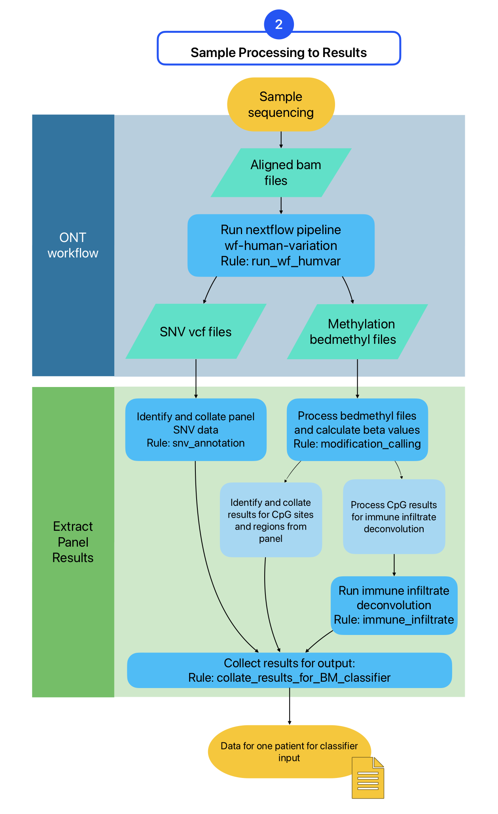

# Panorama

The goal of this pipeline was to design and develop a proof-of-concept bioinformatic software pipeline utilising the capabilities of nanopore sequencing to combine multiple biomarkers of different sources, specifically, mutations, methylation and tumour immune infiltrate. This would enable the prediction of BCG failure in eligible patients. This pipeline was developed to be a clinical bioinformatic workflow that requires little bioinformatic expertise to use. The results of such a tool, with the appropriate pre-clinical trial, could aid in predicting BCG failure, a critical metric for assisting clinicians and patients to choose the most appropriate course of treatment.  

Panorama was developed as part of the Doctoral thesis entitled:  
**Epigenetic Consequences of BCG Immunotherapy In Bladder Cancer**  
For full details on the development of this pipeline the relevant chapter is "Chapter Four: Multi-biomarker discovery using nanopore sequencing technology: proof-of-concept"

Panorama is built using the [Snakemake](https://snakemake.readthedocs.io/en/stable/) workflow language.

## Main Components

* [Section 1](#section-1-adaptive-sequencing-target-file-creation): Adaptive Sequencing Target File Creation
* [Section 2](#section-2-sample-processing-to-get-biomarker-results): Sample Processing to get Biomarker Results
* [Section 3](#section-3-sample-processing-to-patient-report): Sample Processing to Patient Report (reliant on pre-clinical trial using Section 2 outputs) 

## Installation
First ensure [Conda](https://anaconda.org/anaconda/conda) and [Docker](https://www.docker.com) are installed. Then carry out the below.  

```bash
git clone https://github.com/lucy924/nanopore_multiBM_pipeline.git
cd https://github.com/lucy924/nanopore_multiBM_pipeline.git
conda create -n panorama_venv conda=24.7.1 peppy=0.40.7 bioconda::snakemake=8.27.1 nextflow=23.04.4
conda config --set channel_priority strict
conda activate panorama_venv
nextflow pull epi2me-labs/wf-human-variation -r 2.6.0
```

## Usage

### Input
There are two user-defined inputs to run this pipeline. One is the biomarker panel you wish to use, the other is the configuration (config) file in YAML format.  
Both files must be in the `config` directory.  

**Panel**  
This is a csv file containing metadata for each biomarker. See the [panel description](#panel-entry-descriptions) below for a complete list of what is required. An example can be found here:  
[config/panel_metadata.example.csv](config/panel_metadata.example.csv)  

**Config file**  
This is a yaml file (a human readable format), that the pipeline requires. This is where you put paramters such as the project name, sample name, name of the panel.csv file, and the path to the output bams from MinKNOW. Everything else can be left as it is, *unless* you need to change certain parameters after running Section 1.  
You may need to adjust `buffersize` to bring your adative sampling file into the range specified by `min_/max_` `genome_coverage`, or you can tweak the coverage numbers if you are confident doing so.

There are two output files from Section 1 for use in MinKNOW.
1. For adaptive sampling use this file: `targets_buffered.bed` located here: `minknow_input/targets_buffered.bed`
2. For alignment during the run you may use the buffered file above, or you can use the file: `targets_for_align.bed` located here: `minknow_input/targets_buffered.bed`


The first command in each below section is to get a flow chart of steps the pipeline will run (a [DAG](https://en.wikipedia.org/wiki/Directed_acyclic_graph)).

### To run Section 1
```bash
snakemake --dag get_input_for_minknow | dot -Tsvg > dag.get_input_for_minknow.svg
snakemake get_input_for_minknow --use-conda
```

### To run Section 2
```bash
snakemake --dag run_sample_panel_for_BM_classifier | dot -Tsvg > dag.run_sample_panel_for_BM_classifier.svg
snakemake run_sample_panel_for_BM_classifier --use-conda
```

### To run Section 3
```bash
snakemake --dag get_report_for_sample | dot -Tsvg > dag.get_report_for_sample.svg
snakemake get_report_for_sample --use-conda
```

<!-- ## Contributing

Contributions are welcome! Please open an issue or submit a pull request. -->

## License

This project will likely be open-source, however, it is not ready for a license yet. This will be updated as soon as possible.


## Panel entry descriptions
Note an example can be found here: [config/panel_metadata.example.csv](config/panel_metadata.example.csv)  

| Parameter name                      | Type    | Required? | Description                                                                                                                                                                                                                                                                                                                                                                                                                                                                                                                                                            |
|-------------------------------------|---------|-----------|------------------------------------------------------------------------------------------------------------------------------------------------------------------------------------------------------------------------------------------------------------------------------------------------------------------------------------------------------------------------------------------------------------------------------------------------------------------------------------------------------------------------------------------------------------------------|
| ID                                  | string  | Required  | A unique ID number 3 characters long (e.g. 001).                                                                                                                                                                                                                                                                                                                                                                                                                                                                                                                       |
| Biomarker Name                      | string  | Required  | A name suitable for the biomarker. Initially used for gene names. Can be used for multiple biomarkers.                                                                                                                                                                                                                                                                                                                                                                                                                          |
| Biomarker Type                      | string  | Required  | One of: snv, sv, mod, area_mutations, expression, exp_ratio, immune_ratio, immune_inf, microsatellite, demographic, clinicopathology.                                                                                                                                                                                                                                                                                                                                                                                           |
| Panel or Area of Interest?          | string  | Required  | Is this part of the Panel or is it an extra region (Area of Interest) that's been individually requested? Options are "Panel" or "AOI".                                                                                                                                                                                                                                                                                                                                                                                         |
| chrom, start pos, end pos           | strings | Required  | Genome coordinates of the desired area. Handles both comma separated numbers and normal numbers.                                                                                                                                                                                                                                                                                                                                                                                         |
| length                              | number  | Optional  | Length of the genomic region. Will auto calculate.                                                                                                                                                                                                                                                                                                                                                                                                                                                                              |
| strand                              | string  | Optional  | Which strand is the feature of interest on? "+" or "-". Required if the answer for "Is this record the whole gene" is "Yes".                                                                                                                                                                                                                                                                                                                                                            |
| Scoring Type                        | string  | Required  | Options are: "genotypic", "continuous" or "categorical". Others may be added in the future. If this is not included there will be no automatic analysis as part of the panel.                                                                                                                                                                                                                                                                    |
| Result Options                      | string  | Required  | All possible results. For genotypic data, single genotype in the format “Allele 1\|Allele 2”, or multiple genotypes separated by a “/“ character “Allele 1\|Allele 2/Allele 1\|Allele 2/Allele 1\|Allele 2”. For continuous data, a range in the format: 0.0-1.0. For categorical data, the options separated by "/". If this is not included there will be no automatic analysis as part of the panel.                                             |
| Result                              | string  | Optional  | Available for Clinicopathologic and Demographic results.                                                                                                                                                                                                                                                                                                                                                                                                                                                                        |
| Notes                               | string  | Optional  | Any notes the user wants to add.                                                                                                                                                                                                                                                                                                                                                                                                                                                                                               |
| References                          | string  | Optional  | The references where the biomarker was found. Will be added to the final report in the future.                                                                                                                                                                                                                                                                                                                                                                                          |
| Is variant in coding region? (snv)   | string  | Required  | "Yes" or "No".                                                                                                                                                                                                                                                                                                                                                                                                                                                                                                                  |
| SNP ID (snv)                        | string  | Optional  | rs ID number.                                                                                                                                                                                                                                                                                                                                                                                                                                                                                                                   |
| Is variant in coding region? (mod)   | string  | Required  | "Yes" or "No".                                                                                                                                                                                                                                                                                                                                                                                                                                                                                                                  |
| Is this record the whole gene? (mod) | string  | Required  | "Yes" or "No". If "Yes", the target region will be extended to include promoter (2000 bp) and downstream (1000 bp). Also the "strand" is required.                                                                                                                                                                                                                                                                                                                                     |
| Illumina EPIC ID (mod)               | string  | Optional  | The EPIC id associated with the modification site.                                                                                                                                                                                                                                                                                                                                                                                                                                                                             |
| DNA methylation region (mod)         | string  | Required  | Options are "position" (for a single site), "promoter", "intragenic", or "downstream".*                                                                                                                                                                                                                                                                                                                                                                                                |
| Is variant in coding region? (area_mutations)   | string  | Optional  | "Yes" or "No".                                                                                                                                                                                                                                                                                                                                                                                                                                                                          |
| Is this record the whole gene? (area_mutations) | string  | Required  | "Yes" or "No". If "Yes", the target region will be extended to include promoter (2000 bp) and downstream (1000 bp). Also the "strand" is required.                                                                                                                                                                                                                                                       |
| Expression Ratio Components (exp_ratio)         | string  | Required  | Each component of the ratio has a separate biomarker panel ID number, and the “Biomarker Name” must match the entry in “Expression Ratio Components”. Format is "Biomarker Name 1"/"Biomarker Name 2".                                                                                                                     |

## Config description
Note the config can be found here: [config/config.yaml](config/config.yaml)  
Edit this file to your parameters.

| Parameter group | Parameter name         | Type    | Description                                                                                 | Testing value                                                      |
|-----------------|-----------------------|---------|---------------------------------------------------------------------------------------------|--------------------------------------------------------------------|
|                 | project                | string  | Project name                                                                                 | 'BCG_on_NMIBC'                                                     |
|                 | sample                | string  | Sample name                                                                                 | 'test6'                                                     |
|                 | panel_metadata        | string  | Path to the input panel file, should be located in the "config" directory.                  | "config/panel_metadata.example.csv"                       |
|                 | bam_pass_directory    | string  | Full path to the sequenced and aligned bam files, output by MinKNOW.                        | "/external/data/lucy/20241107-BiomarkerProject/merged_bams"        |
|                 | buffersize_bp         | integer | The size of the buffer in base pairs to apply to either side of the target sequence.        | 2000                                                               |
|                 | min_genome_coverage   | float   | Minimum percent of the genome to cover by the MinKNOW input file.                           | 0.5                                                                |
|                 | max_genome_coverage   | float   | Maximum percent of the genome to cover by the MinKNOW input file.                           | 2.0                                                                |
|                 | max_cores             | integer | Maximum number of cpu threads allowed during pipeline processes.                             | 16                                                                 |
| nextflow        | basecaller            | string  | Fallback basecaller for the nextflow pipeline.                                              | "dna_r10.4.1_e8.2_400bps_hac@v4.1.0"                              |
| nextflow        | threads               | integer | Maximum number of cpu threads allowed during nextflow.                                      | 16                                                                 |
| nextflow        | profile               | string  | Profile to use for nextflow (e.g. singularity, docker)                                      | "standard"                                                         |

## Section Details
### Section 1: Adaptive Sequencing Target File Creation


Adaptive sequencing target file creation. Required input files are the config file containing pipeline parameters (such as the sample name and project name), the CSV file of the panel of biomarkers, and the reference fasta file (hg38). These files are then processed to output a bed file containing buffered genomic regions for input to MinKNOW. This file is checked to ensure it meets the genome coverage requirements. If it does not, the `buffersize_bp` parameter in the config file should be adjusted by the user.

### Section 2: Sample Processing to get Biomarker Results



A sample is first prepared, and using the input bed file from Part One, undergoes adaptive sequencing using the nanopore device. The aligned BAM files, output by MinKNOW, are used as input to this section of the Snakemake pipeline, which begins by running the nextflow workflow [wf-human-variation](https://github.com/epi2me-labs/wf-human-variation) by EPI2ME Labs. The resulting VCF files containing SNVs are processed, extracting the results that are specific to the panel targets. Similarly, bedmethyl files containing methylation data are processed, first calculating methylation beta values (a standard methylation measurement) and then extracting CpG methylation data specific to panel targets. Immune infiltrate is calculated from the methylation data, and then these results, along with SNV and CpG panel targets, are added to a final data file containing panel results for the patient. The top panel (blue) indicates parts of this pipeline that use software developed by ONT, and the bottom panel (green) indicates novel parts of the pipeline. The key Snakemake rules for each process are included in the process description.

### Section 3: Sample Processing to Patient Report


A sample is first prepared and sequenced using adaptive sequencing and the generated input bed file from Section 1 on a nanopore device and processed in the same way as Section 2 to extract panel results. Immune infiltrate, SNV and methylation panel targets are collected, and the final score is calculated from the score information obtained from the pre-clinical trial (below). The top panel (blue) indicates parts of this pipeline that use software developed by ONT, and the bottom panel (green) indicates novel parts of the Snakemake pipeline. The key Snakemake rules for each process are included in the process description.

### Preclinical Trial
Suggested use at the Section 2 stage.


The input dataset to the section comprises all the sample data collected as the output of Part Two for the patient cohort. Preprocessing of categorical data types is initially required, followed by splitting into training and testing datasets. Biomarker weighting (blue box) is performed by weights identified in previous literature and/or techniques such as elastic net or simple t-test, likely processed using Bayesian regression. Weights are input into machine learning methods (green box), such as gradient boosting or random forest. Model accuracy metrics are analysed and compared against different approaches to build the best estimator model. Depending on the final method outputs, scores are added to the panel as a hazard ratio or a hazard ratio per standard deviation.

