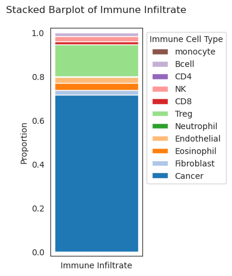
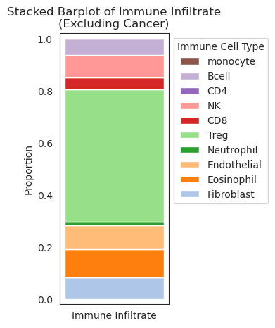

# BCG Susceptibility Panel for NMIBC
*This test combines the results for relevant single nucleotide variants, methylation variants, and immune infiltrate prediction to reach a final score for prediction of BCG treatment success for NMIBC.*  
**Panel name** BCG on NMIBC 
**URL:** https://github.com/lucy924/nanopore_multiBM_pipeline
___
### Clinical Details
**Sample Name:** test4predict 
Bladder lesion, transurethral resection: 
Papillary urothelial carcinoma, high grade (grade 3/3 - WHO 1973) 
Noninvasive, pTa 
**Specimen:** TURBT biopsy  
___
## Overall Result and Interpretation
Tumour is **Somewhat Likely** to respond to treatment. 

*Guidance: Result is out of Highly Unlikely, Somewhat Unlikely, Somewhat Likely, Highly Likely*

**Comments:** The result is an aggregate score obtained by combining the scores of biomarkers that reach read depth threshold and fall within respective scoring parameters.

___
## Immune infiltrate results

| Immune infiltrate proportions (full) | Immune infiltrate proportions (non-malignant only) |
| --- | --- |
|  |  |

   
   

___
## Raw results
*Guidance: Total (normalised) Score is a scale of 0% – 100%. 0% will respond and 100% will not respond to BCG treatment. Most results will fall between 25% and 75%. We recommend treatment with BCG when the result is \<50% for patients who are otherwise healthy, and \<40% for all other patients.*

| **ID** | Biomarker name | Biomarker type | Result Options | Result | Score | 
|---:|---|---|---|---|---|
|**004**|NOS3|snv|T\|T/T\|A/T\|G/A\|A/A\|G/G\|G|G\|G|0.16|
|**005**|NOS3|snv|C\|C/C\|T/T\|T|T\|C|0.53|
|**009**|CHST11|mod|0.0-1.0|0.12|2.63|
|**010**|KLF8|mod|0.0-1.0|0.24|1.67|
|**011**|GPR158|mod|0.0-1.0|0.26|2.92|
|**012**|C12orf42|mod|0.0-1.0|0.23|1.78|
|**013**|WDR44|mod|0.0-1.0|0.69|1.13|
|**014**|FLT1|mod|0.0-1.0|0.04|1.54|
|**022**|PMF1|mod|methylated/unmethylated|unmethylated|1.21|
|**025**|IL1B|snv|G\|G/G\|A/A\|A|G\|A|1.0|
|**026**|IL1RAP|snv|G\|G/G\|A/A\|A\|G|G\|A|1.0|
|**027**|IL1RAP|snv|G\|G/G\|C/C\|C|G\|C|1.0|
|**028**|IL1RAP|snv|T\|T/T\|A/T\|C/A\|A/A\|C/C\|C|A\|C|1.0|
|**029**|IL1RAP|snv|G\|G/G\|A/A\|A|G\|A|1.0|
|**030**|IL18R1|snv|C\|C/C\|T/T\|T|T\|T|0.16|
|**031**|IL18R1|snv|G\|G/G\|C/C\|C|T\|T|1.0|
|**032**|IL18R1|snv|C\|C/C\|A/A\|A|T\|T|1.0|
|**033**|IL18R1|snv|C\|C/C\|T/T\|T|T\|T|0.16|
|**035**|IL18R1|snv|G\|G/G\|A/A\|A|A\|A|0.16|
|**036**|IL18R1|snv|G\|G/G\|A/A\|A|A\|A|1.0|
|**401**|LMR|immune_ratio|0.0-10.0|2.97|4.94|
|**402**|NLR|immune_ratio|0.0-10.0|0.34|1.65|
|**403**|monocyte_inf|immune_inf|0.0-1.0|NA|NA|
|**405**|Bcell_inf|immune_inf|0.0-1.0|0.02|1.71|
|**406**|CD4_inf|immune_inf|0.0-1.0|0.0|0.33|
|**408**|CD8_inf|immune_inf|0.0-1.0|0.01|0.07|
|**409**|Treg_inf|immune_inf|0.0-1.0|0.14|1.52|
|**Total (raw)**|||||33.50|
|**Total (normalised to 0.0 - 100.0)**|||||47.05|

<!-- 
   -->

___
## Methodology
Nanopore sequencing was used to detect single nucleotide variants, methylation status and immune status (by methylation) of the tumour sample. 
